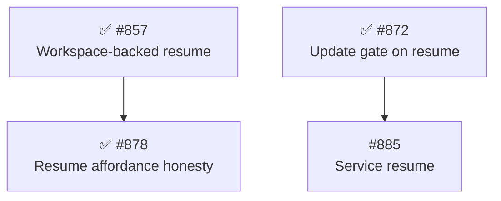

# Identify improvement-roadmap steps by issue number

## Release Recommendation

**Release:** ship independently

This is repo-root tooling — `.pi/skills/` and `.pi/prompts/` only.
No file under `packages/` is touched, so no package has a releasable commit and nothing will actually release.
The marker is written anyway because `/ship` reads it before any irreversible work, and its absence is itself reported.
The issue belongs to no package improvement roadmap, so there is no batch to join.

## Problem Statement

An improvement-roadmap step's ordinal does three jobs at once: it identifies the step, it states the step's position in the recommended working sequence, and it records when the step was discovered.
Identity and provenance want never to change; position wants to change freely.
Today they cannot be separated, because renumbering is not available — the ordinal has escaped the document into 800 `Phase N Step M` references across committed plans, retro stage notes, `docs/architecture/history/` files, `AGENTS.md`, and GitHub issue bodies that cannot be rewritten at all.

So steps are numbered in discovery order and the sequence is maintained by prose around them.
Mid-phase insertion is the normal case, not the exception: pi-subagents Phase 22's Steps 10 through 19 were every one of them filed mid-phase by another step's planning or review, and each landed at the end of the list regardless of where in the sequence it belonged.

The fix is to stop numbering.
Identify a step by its GitHub issue number, and let the order of the sections in the document be the working sequence.
Inserting a step at any priority becomes "write the section where it belongs".

## Goals

- Identify a roadmap step by its issue number: the heading becomes `#### ✅ [#878] Title`.
- Make section order the canonical working sequence, so insertion needs no renumbering.
- Replace ordinals with `[#N]` in dependency lines, tracks, release batches, and sweep dispositions, where they are directly clickable rather than needing a lookup.
- Move issue filing ahead of the roadmap write in `/plan-improvements`, collapsing the current roadmap-commit-then-link-back-commit sequence into one commit.
- Keep every consumer working against **both** heading shapes for as long as the two live phases carry ordinals.
- Preserve "step" as a noun — "the [#878] step", "each step's `Release:` tag".

This change is not breaking in the semver sense: it ships no package code and alters no published contract.
It is a workflow change for the operator only in that the next `/plan-improvements` run produces a differently shaped roadmap.

## Non-Goals

- Rewriting archived `history/` files, existing plans, retros, or `AGENTS.md`'s `Phase 14 Step 10` / `Phase 22 Step 13` citations.
  Completed phases keep their ordinals, so those references stay valid.
  Rewriting them would falsify the record, and no script can tell a live step from an archived one inside natural-language prose.
- Converting the two live phases. pi-subagents Phase 22 (19 steps, 3 open) and pi-permission-system Phase 15 (7 steps) keep their ordinals through their close and archive under them.
  This is what forces the dual-shape detection in `/finish-phase`.
- Deriving the working sequence from each step's `Priority` and dependency fields.
  Filed as [#894], which explicitly waits on this change to decide what its parser reads.
- Revisiting the `improvement-discovery` skill's "Max 9 steps per phase" ceiling.
  Live Phase 22 has 19 steps, so the ceiling is already not holding, but that is a separate question about phase budgeting rather than step identity.
- Bumping `rumdl` off the 0.2.24 pin.
  Filed as [#900] with this session's measurement.
  The two are independent: the proposed format was checked clean under 0.2.24 **and** 0.2.68 (see Test Impact Analysis).
- Renaming the prompts' own `## Step 1`–`## Step 10` workflow headings.
  `plan-improvements.md`, `finish-phase.md`, `retro.md`, and the agent files all number their own procedures, and those ordinals are unrelated to roadmap steps.
- Any change to `.pi/prompts/ship.md`, `.pi/prompts/triage-backlog.md`, or `AGENTS.md`.
  Each refers to a roadmap step without parsing its shape (see "Files deliberately not changed").
  `.pi/agents/pre-completion-reviewer.md` is likewise unparsed, but one word of it describes the very gate this change re-keys and is corrected (see "Files deliberately not changed").

## Background

### What a step looks like today

The format is specified in `.pi/skills/improvement-discovery/SKILL.md` under `## Output format`, and rendered in both live roadmaps:

````markdown
#### ✅ Step 15: Stop advertising a resume that will be refused ([#878])

**Cause:** `renderQuestionAffordance` renders the resume line from `pendingQuestion` alone.

- **Smell:** Category C (coupling/boundary flaw).
- **Hard dependency:** after Step 10, which creates the condition.
- **Outcome:** the affordance is rendered only when the record can actually be resumed.
- **Commit type:** `fix:`.
- **Impact 4 / Risk 2 / Priority 16.**

Release: independent
````

The ordinal also appears in the Mermaid node (`S15["✅ Step 15 (#878)<br/>Resume affordance honesty"]`), the parallel-track list, the release batches, and the sweep dispositions.

### Who reads the shape

Measured across `.pi/`, only three consumers actually parse it, and two of them can stop:

| Consumer                             | Today                                                      | Under issue identity                                          |
| ------------------------------------ | ---------------------------------------------------------- | ------------------------------------------------------------- |
| `/tdd-plan` L150, `/build-plan` L115 | `grep -c '✅.*Step <N>'` must report 2                     | Re-key on the issue number — shape-agnostic, works under both |
| `/finish-phase` L171, L173           | `grep -nE '^#+ .*Step [0-9]'` detection and tolerant count | Must match both shapes for as long as the live phases exist   |
| `/plan-issue` L78                    | greps `(#$1)` / `[#$1]` for the `Release:` tag             | Already issue-keyed; unaffected                               |

The rest name a roadmap step in prose without parsing it.

### The scripted-edit hazard

`plan-improvements.md` carries `### Step 1`–`### Step 8` for its own analysis workflow, `finish-phase.md` carries `## Step 1`–`## Step 6`, and `retro.md` carries `## Step 1`–`## Step 10`.
A `Step N` → `[#N]` sweep would destroy all of them.
Every edit in this plan is hand-placed; no scripted substitution is used anywhere.
This is the `AGENTS.md` rule against multi-line scripted substitution across similar blocks, applied to prose.

### Constraints from `AGENTS.md`

- A prompt or skill often states its workflow twice — a narrative list plus an Output-format section.
  Editing one leaves the other stale (Refs #534), which is why `plan-improvements.md`'s filing resequence touches its Output section, its "File the issues" section, and the hard gate at L46.
- A step renaming a named concept another doc may cite widens the grep to the whole `.pi/` tree, not `package-*` alone (Refs #601).
- `/tdd-plan` and `/build-plan` land the `✅` step-mark at implementation completion (Refs #540, #872); that gate is exactly what breaks here.

## Design Overview

### The step block

````markdown
#### ✅ [#878] Stop advertising a resume that will be refused

**Cause:** `renderQuestionAffordance` renders the resume line from `pendingQuestion` alone.

- **Smell:** Category C (coupling/boundary flaw).
- **Hard dependency:** after [#857], which creates the condition.
- **Outcome:** the affordance is rendered only when the record can actually be resumed.
- **Commit type:** `fix:`.
- **Impact 4 / Risk 2 / Priority 16.**

Release: independent
````

The `✅` keeps its leading position, so `grep '✅'` still finds a completed step.
The title carries no colon: today's "use a colon after `Step N`, never an em dash" rule exists only because `Step N` is a prefix needing a separator, and it dissolves with the prefix.

A step that absorbs a folded-in issue leads with its primary issue and names the fold-in as a suffix:

```markdown
#### [#802] The policy-scope export and a launcher that consumes it (with [#892])
```

This preserves the primary/folded distinction today's `([#802], with [#892])` carries, and keeps the issue-keyed `✅` grep counting the primary issue exactly twice.

### The diagram

The diagram stays purely structural — it lays out by dependency, not by sequence, exactly as today.
Node IDs become `S<issue>`, which keeps them valid non-numeric-leading Mermaid identifiers:



The bare `#878` in the label is what makes the `✅`-mark verification count 2 (heading plus node).
A `[#878]` reference link inside a Mermaid label would not render, so the node uses the bare form — this is the same split the current format already uses.

### Tracks, batches, and dispositions

```markdown
### Parallel tracks

- **Track A — Result delivery:** [#857] → [#878] (hard ordering).

### Release batches

- **Batch "front-door-majors":** [#872], [#885] (ship together; tail = [#885]).
- Independently releasable: [#857], [#878].
```

`/plan-issue`'s batch-tail lookup gets strictly easier: it already knows the issue number it is planning, and the batch member list now spells the same token.

The sweep-disposition bullet drops the ordinal from both halves:

```markdown
- [#857] — filed by [#465]'s planning; becomes a step in this phase, placed after [#465].
  `completeRun()` disposes the child's workspace and `resume()` never re-prepares it.
```

"Becomes a new step in this phase" is still one of `roadmap-fit`'s four dispositions; what changes is that the operator's decision is now purely *where in the section order the step goes*, which is the decision actually being made.

### Filing before the write

Under issue identity the heading *is* the number, so the issues must exist before the roadmap can be written.
`/plan-improvements` today commits the roadmap, then asks whether to file, then makes a second link-back commit appending `([#N])` to each heading and `(#N)` to each Mermaid node.
That link-back pass disappears.

The new sequence:

1. Step 8 composition `ask_user` — already bundles the declared candidate, track composition, repeat-deferral dispositions, and cadence question.
   It gains the filing confirmation, so approving the composition approves filing its issues.
2. File the issues for steps that do not already have one (steps adopted from existing issues need nothing, as today).
3. Write the roadmap with `[#N]` headings and commit **once**.

Declining the filing ends the run: the session reports the proposed composition and writes no roadmap.
There is no half-written document to clean up, which is what makes the decline safe.

Issue **bodies** still cross-reference siblings in prose rather than by number — a body filed first cannot cite a sibling filed after it.
That existing rule stays, with its rationale updated from "the issue numbers are not known until filed" to the narrower "a sibling filed later has no number yet".

### Dual-shape detection

The two live phases keep ordinals and will archive under them, so `/finish-phase` must recognize both.
One regex covers it:

```bash
grep -cE '^#+ .*(\bStep [0-9]|\[#[0-9]+\])' <doc>
```

Measured: 19 against pi-subagents' live roadmap, 7 against pi-permission-system's, 2 against a new-format sample, with no false positives from any other heading in either document.

`/tdd-plan` and `/build-plan` need no dual detection at all, because re-keying their gate on the issue number makes it shape-agnostic:

```bash
grep -cE '✅.*#<N>\b' <arch-doc>   # 2 under both shapes
```

This is a strict improvement over the current `grep -c '✅.*Step <N>'`, which is also brittle to the folded-in-issue heading form.

## Module-Level Changes

### `.pi/skills/improvement-discovery/SKILL.md` — changed

The authority for the format; everything else conforms to it.

- L205 — grouping heuristic "if Step B depends on Step A's output, order them" reworded to name the section-order sequence.
- L221 — "**Step list** — numbered steps, each with:" → steps in working-sequence order.
- L232 — the "use a colon after `Step N`, never an em dash" rule is removed; the ordinal prefix it disambiguates no longer exists.
  Replaced by a sentence stating the heading shape and that section order is the working sequence.
- L235 — the worked step-block example rewritten to `#### [✅ ][#NNN] Title`, including the fold-in suffix form.
- L269–L270 — the `Release batches` example rewritten to `[#N]` members and `tail = [#N]`.
- Add a sentence recording that insertion is the normal case and that nothing renumbers.

`#### Open-issue sweep dispositions` (L277) keeps its exact spelling — it is grepped by `roadmap-fit` and `/finish-phase` and is not a step heading.

### `.pi/prompts/plan-improvements.md` — changed

- L46 — the hard gate's "numbered steps with `Outcome:` lines" description of an unarchived roadmap.
- L199–L202 (Output section 2) — "Numbered steps with:" and its bullet list.
- L204 — the `Release:` tag bullet is unaffected in form; the surrounding sentence is checked for ordinal language.
- L205–L207 (Output sections 3–5) — diagram, tracks, and `Release batches` descriptions gain the `[#N]` spelling; the batch subsection's "last listed = tail" wording is preserved verbatim, since `/plan-issue` depends on it.
- L209–L216 — the "present a summary and ask whether to commit" step, now preceded by filing.
- L218–L232 (`## File the issues`) — moved ahead of `## Output` and rewritten: filing is confirmed in the Step 8 composition gate, adopted-issue steps need no filing, the link-back sub-step (L230) is deleted, and the commit becomes one.
- L228 — the "referencing cross-step dependencies as 'Phase N Step M' prose" rule kept but re-justified: a sibling filed later has no number yet.
- L147–L179 (Step 8) — the composition `ask_user` bundle gains the filing confirmation and the consequence of declining.

Per Refs #534 this file states its workflow twice; both the Step 8 narrative and the Output/File-the-issues sections are edited in the same commit.

### `.pi/skills/roadmap-fit/SKILL.md` — changed

- L35 — "Read the roadmap's numbered steps".
- L58 — the disposition bullet template: `filed by <Step M's planning | Step M's implementation | the #X retrospective>` → `[#M]`-keyed, with the "becomes a step in this phase, placed after [#X]" phrasing replacing an ordinal assignment.
- The Step 3 fold-in instruction ("its heading gains the issue `([#610], with [#753])`") → `#### [#610] Title (with [#753])`.
- The disposition table's "Becomes a new step in this phase" row gains a clause naming section placement as the decision.

### `.pi/prompts/finish-phase.md` — changed

The only consumer needing genuine dual-shape detection.

- L171 — the "do not hardcode `^### Step`" guidance extended: the shape now varies by *identity scheme* as well as by `✅` prefix and heading level.
- L171 detection command and L173 tolerant count → `grep -cE '^#+ .*(\bStep [0-9]|\[#[0-9]+\])'`.
- L177 — "no `Step`-heading for the archived phase survives outside the history file" widened to the same dual form.
- L66 — "issues carrying a numbered step".
- L115 — the mid-phase-label example (`"as of Step N"`, `"Phase N Step M"`) kept, since a mid-phase label under either scheme is the target.
- L150 — "numbered steps with outcomes".
- L154 — the per-step layout note (`#### ✅ Step N:` headings) gains the `#### ✅ [#N]` shape.
- Step 5.1's heading-level promotion note (`####` → `###`) is unaffected in mechanism and is checked for ordinal language.

### `.pi/prompts/tdd-plan.md` — changed

- L149 — "a numbered roadmap step" → "a roadmap step".
- L150 — `grep -c '✅.*Step <N>' <arch-doc>` → `grep -cE '✅.*#<N>\b' <arch-doc>`, still "must report 2".
  The `Refs #872` citation stays; the mechanism it records is unchanged.

### `.pi/prompts/build-plan.md` — changed

- L114 — "a numbered roadmap step" → "a roadmap step".
- L115 — the same grep replacement as `tdd-plan.md`.

L75's "For **each** numbered step in the plan's 'TDD Order'" refers to *plan* steps, not roadmap steps, and is left alone.

### `.pi/prompts/plan-issue.md` — changed

- L188 — "When the issue is a numbered roadmap step, list the architecture-doc `✅` step-mark (heading + Mermaid node)".
  Only "numbered" is dropped; the heading-plus-node pairing is unchanged and remains what the `✅` grep counts.

L78–L80 (the `Release:` derivation) is already issue-keyed and needs no edit; it is verified rather than changed.

### `.pi/prompts/retro.md` — changed

- L218 — "the next incomplete numbered step" → "the next incomplete step in the roadmap's section order".
- L219's "If this issue completed the phase's **last** step" is correct under both schemes (section order defines "last") and is left alone.

### Files deliberately not changed

Each is a predicted-unchanged file, with the claim it rests on:

| File                                               | Claim                                                                                                                                                                                                          |
| -------------------------------------------------- | -------------------------------------------------------------------------------------------------------------------------------------------------------------------------------------------------------------- |
| `AGENTS.md`                                        | Its `Phase 14 Step 10` / `Phase 22 Step 13` citations are historical, and both phases keep their ordinals. Its `roadmap-fit` and release-batching paragraphs (L226, L230) describe mechanisms, not step shape. |
| `.pi/agents/pre-completion-reviewer.md`            | L195/L280/L286 say "an earlier, already-completed roadmap step" — no ordinal parsed. L123 says "completes a numbered step" about the gate this change re-keys, so that one word is corrected.                  |
| `.pi/prompts/ship.md`                              | L262 says "the **last** step of a roadmap phase" — correct under both schemes.                                                                                                                                 |
| `.pi/prompts/triage-backlog.md`                    | L56 reads the `## Improvement roadmap` section heading, which does not change.                                                                                                                                 |
| `.pi/skills/package-pi-permission-system/SKILL.md` | Two instances — L19 ("a flat numbered step list") and L21 ("completes a numbered roadmap step"). Operator scoped the change to the eight files above; both recorded as known residuals.                        |
| `packages/*/docs/architecture/architecture.md`     | Both live phases keep ordinals through their close; that is the premise of the dual-shape detection.                                                                                                           |
| `.pi/skills/mermaid/SKILL.md`                      | Its `S1["✅ Step 1 - Spike (#446)"]` example illustrates label quoting, which the new node form also requires.                                                                                                 |

## Test Impact Analysis

This is a prompt-and-skill change, so the shell commands the new text prescribes are its testable surface.
Every one below was dry-run this session against the real tree and a new-format sample; `/build-plan` re-runs them as verification.

The sample (`/tmp/p893/sample2.md`, reconstructed by the implementing session) exercises the full format: two step headings including a fold-in suffix, `[#N]`-leading disposition bullets, a `Hard dependency: after [#857]` line, the Mermaid block, tracks, batches, and reference definitions.

### The new commands

| Command                                                   | Target                                    | Measured                 |
| --------------------------------------------------------- | ----------------------------------------- | ------------------------ |
| `grep -cE '✅.*#878\b' <arch-doc>`                        | pi-subagents live roadmap (ordinal shape) | 2                        |
| `grep -cE '✅.*#878\b' <sample>`                          | new-format sample                         | 2                        |
| `grep -cE '^#+ .*(\bStep [0-9]\|\[#[0-9]+\])' <arch-doc>` | pi-subagents live roadmap                 | 19 (its real step count) |
| same                                                      | pi-permission-system live roadmap         | 7 (its real step count)  |
| same                                                      | new-format sample                         | 2                        |

The dual regex was also checked for false positives: `grep -nE '^#+ .*\[#[0-9]+\]' <doc> \| grep -v Step` returns nothing in either live document, so no non-step heading is admitted.

### Falsification — the changes are load-bearing

| Current command                 | Against new-format sample | Consequence if unchanged                                             |
| ------------------------------- | ------------------------- | -------------------------------------------------------------------- |
| `grep -c '✅.*Step 878'`        | 0                         | `/tdd-plan` step 7 would refuse every new-format step completion     |
| `grep -cE '^#+ .*\bStep [0-9]'` | 0                         | `/finish-phase` would report "lost every step" and refuse to archive |

Both were run; both returned 0.
This is the docs-plan analogue of a killing mutation — the old command dies against the new shape, which is what proves the replacement is doing work rather than being cosmetic.

### The format itself

| Check                                                       | Result             |
| ----------------------------------------------------------- | ------------------ |
| `pnpm exec rumdl check --config .rumdl.toml <sample>`       | Success, no issues |
| `pnpm exec rumdl fmt <sample>` then `diff`                  | byte-identical     |
| `pnpm dlx rumdl@0.2.68 check --config .rumdl.toml <sample>` | Success, no issues |
| `mmdc -i <extracted block> -o /tmp/d.svg --quiet`           | mermaid OK         |

The 0.2.68 run is what establishes that this change and [#900] are independent: the 481 MD013 findings 0.2.68 reports repo-wide are pre-existing prose in `docs/`, and none of them is the roadmap format.

Note the config flag: `rumdl` does not discover `.rumdl.toml` for a file outside the repository, so a sample checked without `--config` reports spurious `MD013` line-length findings against the default 80-character limit.

### What is not testable here

No command verifies that prose reads correctly under the new vocabulary.
The `/build-plan` cross-check is a grep for surviving ordinal language in the eight edited files, listed per step in the Build Order.

## Invariants at risk

| Invariant                                                                              | Where it lives                                                  | How this plan holds it                                                                                                                                     |
| -------------------------------------------------------------------------------------- | --------------------------------------------------------------- | ---------------------------------------------------------------------------------------------------------------------------------------------------------- |
| The `✅` step-mark lands on **both** heading and Mermaid node (Refs #872)              | `/tdd-plan` L150, `/build-plan` L115 — the "must report 2" gate | The replacement grep returns 2 under both shapes, measured; the node keeps a bare `#N` precisely so it still counts                                        |
| `#### Open-issue sweep dispositions` keeps that exact spelling                         | `roadmap-fit` Step 3, `/finish-phase` Step 2.3                  | Not a step heading; explicitly out of scope of every edit                                                                                                  |
| The `Release:` per-step tag and `Release batches` subsection stay grep-able, not prose | `improvement-discovery` Output format 5, `/plan-issue` step 8   | Tag line unchanged; batch members change spelling only, and "last listed = tail" is preserved verbatim                                                     |
| `/plan-issue` can locate a step from an issue number                                   | `/plan-issue` L78                                               | Already issue-keyed; strictly easier under issue identity                                                                                                  |
| A phase archives without losing steps                                                  | `/finish-phase` Step 6.2                                        | Dual regex measured against both live docs at their real step counts                                                                                       |
| Older history files using the `1. ✅ **Title.**` list layout still archive             | `/finish-phase` L154                                            | Pre-existing: `phase-2-remove-scheduling.md` already returns 0 under the current regex, and L154 already says matching the archived layout is not required |

## Build Order

Each step is a `docs:` commit.
The set must land together before the next `/plan-improvements` run — an interleaved run between steps 1 and 2 would write a new-format roadmap under the old filing order (see Risks).

1. **The format spec.**
   Edit `.pi/skills/improvement-discovery/SKILL.md`: the step-block worked example, the `Release batches` example, the grouping heuristic, the "Step list" bullet, and removal of the `Step N`-colon rule.
   Verify: `pnpm exec rumdl check .pi/skills/improvement-discovery/SKILL.md`, and `grep -n 'Step [A-Z0-9]' .pi/skills/improvement-discovery/SKILL.md` returns only the skill's own analysis-workflow references (its `### 1.`–`### 7.` steps and the `Step 2`/`Step 3` cross-references to them).
   Commit: `docs: identify roadmap steps by issue number in the format spec`.
2. **The producer.**
   Edit `.pi/prompts/plan-improvements.md`: move `## File the issues` ahead of `## Output`, fold the filing confirmation into the Step 8 composition gate, delete the link-back sub-step, collapse to one commit, and update the Output section's step/diagram/track/batch descriptions and the L46 hard gate.
   Verify: `rumdl check`; `grep -n 'link.back\|link the doc back' .pi/prompts/plan-improvements.md` returns nothing; the file's `### Step 1`–`### Step 8` headings are all still present (`grep -c '^### Step ' == 8`).
   Commit: `docs: file roadmap issues before writing the roadmap`.
3. **The mid-phase filing path.**
   Edit `.pi/skills/roadmap-fit/SKILL.md`: the disposition bullet template, the fold-in heading form, the disposition-table row, and "numbered steps" at L35.
   Verify: `rumdl check`; `grep -n 'Step M\|Step N' .pi/skills/roadmap-fit/SKILL.md` returns nothing outside the skill's own `## Step 1`–`## Step 4` headings.
   Commit: `docs: key roadmap-fit dispositions to issue numbers`.
4. **Dual-shape archiving.**
   Edit `.pi/prompts/finish-phase.md`: the L171 detection command, the L173 tolerant count, the L177 survival check, and the L66/L150/L154 vocabulary.
   Verify — run all three against real inputs and record the numbers: `grep -cE '^#+ .*(\bStep [0-9]|\[#[0-9]+\])'` returns 19 for pi-subagents, 7 for pi-permission-system, 2 for the new-format sample; and the false-positive check returns nothing.
   Falsification: the pre-edit `grep -cE '^#+ .*\bStep [0-9]'` returns 0 against the sample.
   Commit: `docs: detect both roadmap step-heading shapes when archiving a phase`.
5. **The completion gate.**
   Edit `.pi/prompts/tdd-plan.md` L149–150 and `.pi/prompts/build-plan.md` L114–115 to the issue-keyed grep.
   Verify: the new command returns 2 against the live pi-subagents doc for `#878`, `#872`, `#857`, and `#830`, and 2 against the new-format sample; the old command returns 0 against the sample.
   Also confirm `build-plan.md` L75's plan-step wording is untouched.
   Commit: `docs: verify the roadmap step-mark by issue number, not ordinal`.
6. **Residual vocabulary.**
   Edit `.pi/prompts/plan-issue.md` L188 and `.pi/prompts/retro.md` L218.
   Verify: `grep -rn 'numbered roadmap step\|incomplete numbered step' .pi/` returns only `.pi/skills/package-pi-permission-system/SKILL.md` L21, the recorded residual.
   Widen to the bare phrase `numbered step` as well — the narrower pattern misses `.pi/agents/pre-completion-reviewer.md` L123 and `.pi/skills/package-pi-permission-system/SKILL.md` L19.
   Confirm `retro.md`'s ten `## Step N` workflow headings are intact (`grep -c '^## Step ' == 10`).
   Commit: `docs: drop ordinal vocabulary from roadmap step references`.

A final sweep runs as part of step 6's verification rather than as its own commit: `grep -rn 'Step [0-9N]' .pi/skills/improvement-discovery/SKILL.md .pi/skills/roadmap-fit/SKILL.md` should surface only each file's own workflow headings.

## Risks and Mitigations

- **A `/plan-improvements` run interleaved with these commits produces an inconsistent roadmap.**
  Between steps 1 and 2 the spec says `[#N]` headings while the producer still commits-then-links-back.
  Mitigation: land all six before opening a phase.
  The window is a single session, and no phase is currently being planned — pi-subagents Phase 22 and pi-permission-system Phase 15 are both mid-flight.
- **The dual regex admits a non-step heading.**
  Any `####`/`###` heading containing `[#N]` matches.
  Measured: zero such headings exist in either live architecture document today.
  Mitigation: `/finish-phase` Step 6.2 already frames the count as a loss check against a known step count, not as an authority on what a step is; the operator reads the number against the roadmap they just archived.
- **A folded-in issue's number appears in a heading, skewing the `✅` count.**
  `#### [#802] Title (with [#892])` yields 2 for `#802` and 1 for `#892`.
  This is the existing behavior — `/tdd-plan`'s gate has always counted the step's primary issue — and the fold-in suffix form was chosen partly to keep it that way.
- **Declining the filing gate leaves a phase unplannable.**
  Under issue identity there is no roadmap to write without issue numbers.
  Mitigation: the decline is defined to end the run with nothing written, so the cost is a re-run rather than a half-finished document.
  This is why the filing confirmation moves into the composition gate the operator is already answering.
- **Prose drift the greps cannot see.**
  An ordinal surviving inside a sentence ("after Step 3") reads plausibly and no gate flags it.
  Mitigation: each Build Order step's verify includes a `grep -n 'Step [A-Z0-9]'` over the edited file, with the expected surviving hits named so an unexpected one stands out.
- **`rumdl` behavior differs between the pinned version and a future bump.**
  Mitigation: the format was checked under both 0.2.24 and 0.2.68 and is clean under each, so [#900] can proceed or not without reopening this decision.

## Open Questions

None blocking.

Two items are recorded rather than resolved:

`.pi/skills/package-pi-permission-system/SKILL.md` keeps ordinal vocabulary in two places — L19's "a flat numbered step list" and L21's "a numbered roadmap step".
Both are package-local, both refer to a phase that keeps its ordinals, and the operator scoped this change to the eight files above.
They become wrong only when pi-permission-system opens its first issue-identity phase, which is a natural moment to fix them in place.

The issue-keyed `✅` gate can report `1` rather than `0` for an incomplete step when a **completed** upstream node shares its Mermaid arrow line: `S17["✅ … (#889)"] --> S19["Step 19 (#898)…"]` yields 1 for `#898`.
The gate asserts exactly 2, so an incomplete step is still correctly refused, and the ordinal-keyed predecessor had the identical property — this is pre-existing behavior rather than something the re-keying introduces.

[#894] asks whether the working sequence should be *derived* from each step's `Priority` and hard dependencies rather than curated.
Its own body notes it is worth re-examining once this format lands — the format may make it unnecessary, or reshape what the script should do.
No work is folded in here.

[#894]: https://github.com/gotgenes/pi-packages/issues/894
[#900]: https://github.com/gotgenes/pi-packages/issues/900
